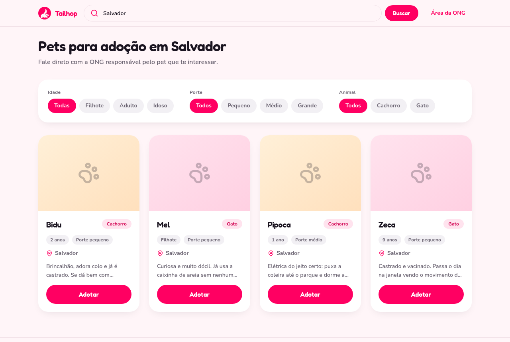
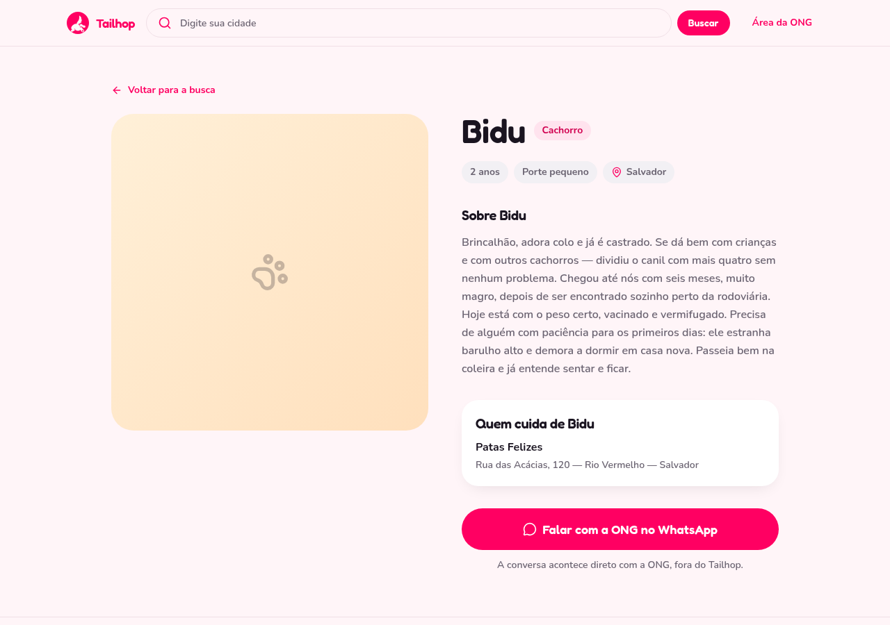
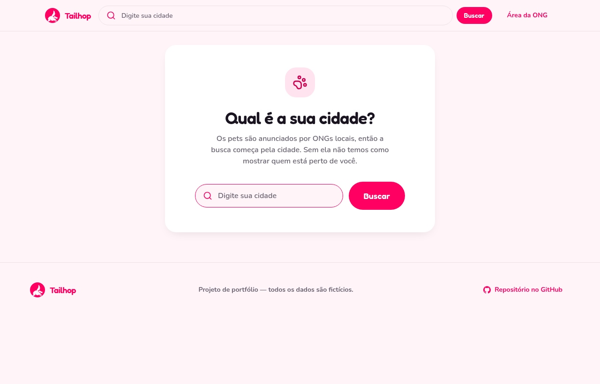
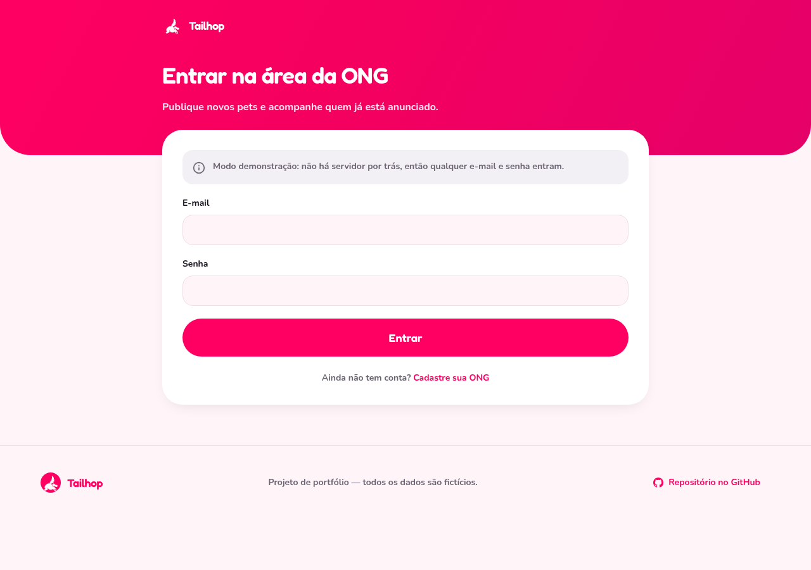
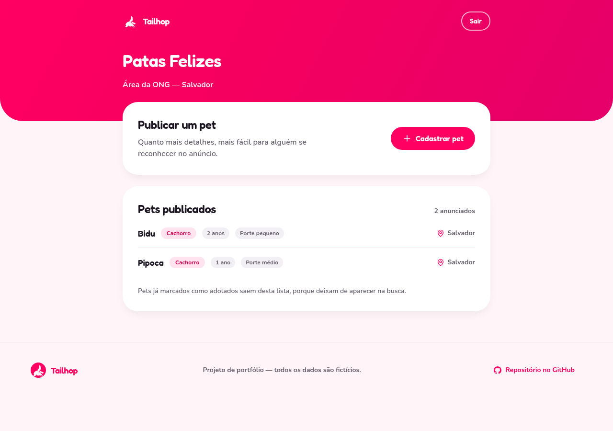
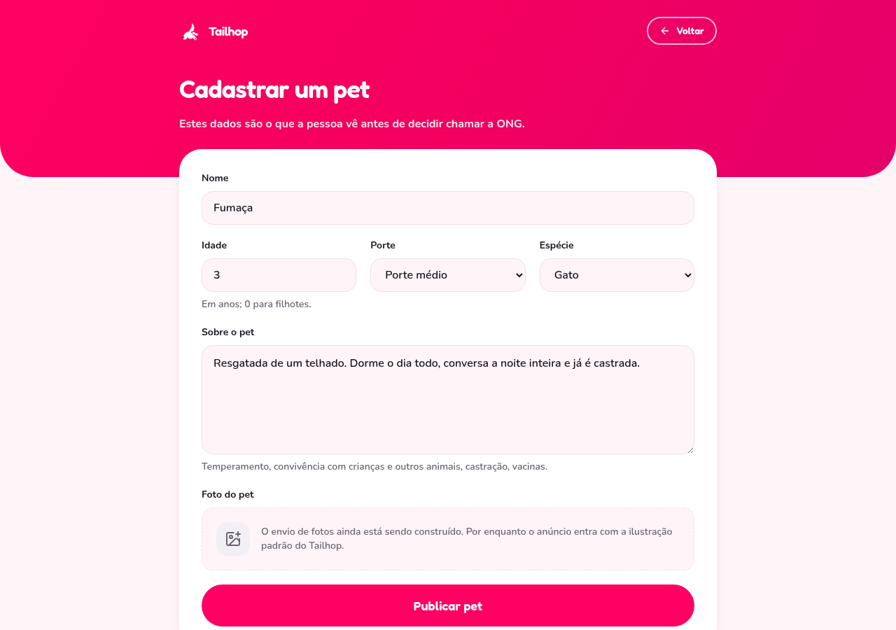
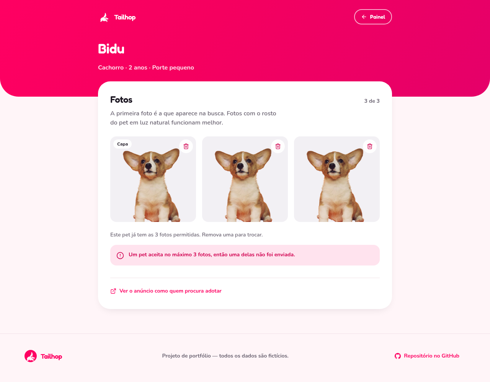
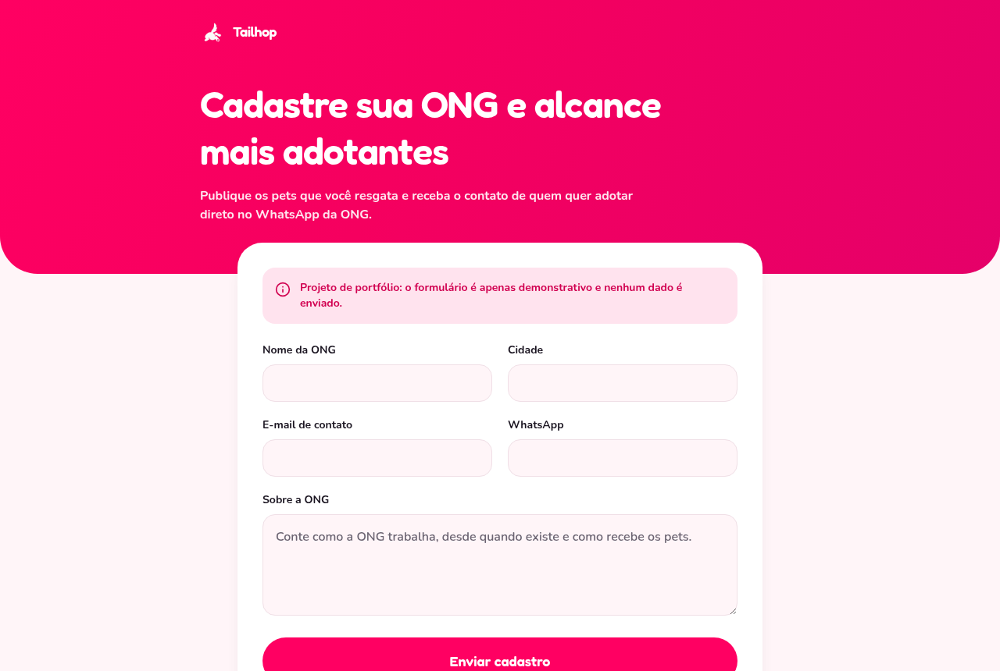
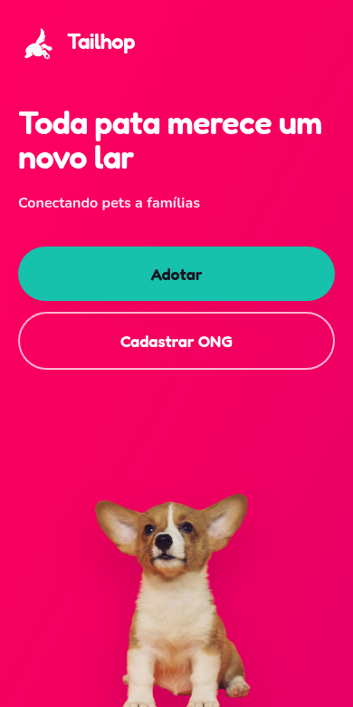
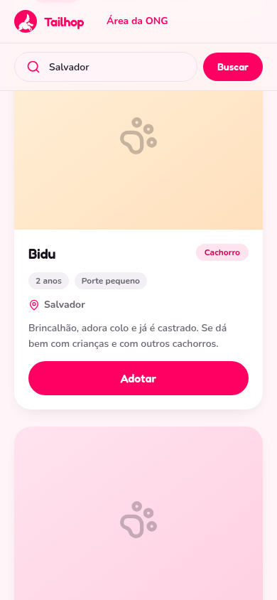

<div align="center">


# Tailhop

**A pet adoption platform that connects animal shelters to people looking to adopt.**

Search for pets in your city, filter by age, size and species, and reach the
shelter straight on WhatsApp. Shelters sign in to publish the pets they rescue.

React 19 · TypeScript · Vite · Tailwind CSS v4

<!-- Once deployed, add the demo here:  **[Live demo](https://your-app.vercel.app)** · -->
**[Backend API →](https://github.com/marcel1712/api-solid)**

</div>

<br>


---

## About the project

Adoption happens through conversation, not checkout. Tailhop is built around
that: the product's job is discovery and the first contact, and it hands the
conversation over to WhatsApp rather than trying to own it.

This is the frontend. It consumes a REST API I also built —
[api-solid](https://github.com/marcel1712/api-solid), a Fastify + Prisma +
PostgreSQL service in a layered architecture (controllers → use cases →
repositories) with 110 passing tests.

Both codebases are mine, so this repo also shows how I work **across** a
boundary: several items below were fixed in the API because that was the right
layer for them, not patched in the client because it was quicker.

## Screens

| Pet listing | Pet page |
| --- | --- |
|  |  |

City is the only required filter, so with none chosen the whole screen asks for
one — the question, the reason and the field in the same place:



The authenticated side, where a shelter publishes pets and closes the ads that
found a home:

| Sign in | Shelter dashboard | Publish a pet |
| --- | --- | --- |
|  |  |  |

| Photos, uploaded straight to R2 |
| --- |
|  |

| Shelter signup |
| --- |
|  |

<table>
<tr>
<td width="50%"></td>
<td width="50%"></td>
</tr>
</table>

The interface is in Brazilian Portuguese, its intended audience.

## Tech stack

| | |
| --- | --- |
| **Framework** | React 19, TypeScript (strict), Vite |
| **Routing** | React Router 7 |
| **Styling** | Tailwind CSS v4, design tokens via `@theme` |
| **Icons** | lucide-react |
| **Quality** | ESLint with the React Compiler rules |
| **Hosting** | Vercel |

**Vite over Next.js.** The site is mostly static with a few client-side API
calls. SSR would have added configuration and a server runtime without buying
anything here, so the tradeoff didn't pay for itself.

**No component library.** The visual identity is specific enough that a kit
would have cost more in overrides than it saved. The handful of primitives the
project needs are built in-house and accessible.

## Engineering highlights

The parts I'd want a reviewer to look at:

**One API client, no scattered `fetch`.** Every request goes through
[`src/lib/api.ts`](src/lib/api.ts), typed against the backend's real contract.
Loading and error handling live in one hook, so no screen invents its own.

**Reading the API before writing the UI.** The approved design assumed data
the API didn't return. Rather than guess, I read the backend's Prisma schema
and controllers and reconciled the two. That review surfaced six mismatches;
three belonged in the API and were fixed there:

- **N+1 on search.** The listing needed each shelter's WhatsApp, which only the
  detail endpoint returned — one extra request per pet. Fixed in the use case,
  which now resolves the numbers from the orgs it had already loaded. Zero
  extra queries; the listing is a single request.
- **Age filtering.** The API matched `age` exactly, so the
  puppy/adult/senior chips couldn't be expressed and would have broken across
  pagination if faked client-side. Became an `ageMin`/`ageMax` range filter.
- **Adopted pets.** Search returned pets already adopted. Now excluded in the
  query, where it belongs, instead of being filtered out after transfer.

**A CORS bug caught by testing the contract, not the mock.** I ran the client
against a server mimicking the real API shape. It failed: I was sending
`Content-Type` on every request, including bodyless `GET`s, which promotes a
simple request into a preflighted one and fires an extra round trip on every
search. Now only requests with a body declare their type.

**Every state is designed, not just the happy path.** Loading uses skeletons
shaped like the real cards, so the layout doesn't jump. Empty results
distinguish "no pets in this city yet" from "your filters are too narrow" and
offer the matching next step. Errors say what to do and offer a retry.

**Accessibility as a floor, not a pass at the end.** Visible focus rings on
both light and brand backgrounds, labelled form fields, results announced via
`aria-live`, and buttons whose accessible names name the pet — a grid of
identical "Adopt" buttons is useless to a screen reader.

**Filters live in the URL.** A search survives a reload and can be shared.

**Requirements taught by the screen, not by a rule.** Pets are listed by city
and the API refuses a search without one. Rather than explain that in a note
pointing at the header, the listing turns into the question when no city is set
— headline, reason and an autofocused field in one place — and the filters stay
hidden, since none of them do anything on their own. An empty screen is an
invitation to act, not a sign saying the form is incomplete.

**A three-step upload, ordered so nothing is left behind.** Photos go to
Cloudflare R2 without passing through the API: ask for a signed URL, `PUT` the
file straight to the bucket, then confirm — the API checks the object is really
in the bucket before writing the row, so an interrupted upload leaves nothing
behind. A `404` on that last step means the file never landed, not that the pet
is gone, and the screen says so. The client asks for the URL at send time, not when the file
is picked — it expires in five minutes, and someone who chooses a photo and
then hesitates would lose the window. `XMLHttpRequest` instead of `fetch`,
because only it reports upload progress, and a phone photo on a bad connection
with no progress bar looks frozen. Wrong file type and oversized files are
refused before any of that: the signature only covers three MIME types, and an
8 MB file shouldn't cross the network to be rejected at the end.

**A page for what the card can't hold.** A card shows two lines of bio; a
shelter writes six, and the part that gets cut is usually the part that decides
an adoption — temperament, history, what the animal needs. So each pet has its
own page with the full text, the photos, and who is caring for it. The card
keeps its WhatsApp button for whoever already decided: the pet's name is the
link, and a pseudo-element stretches the click target across the card without
nesting a button inside a link, which no screen reader announces correctly.

**A confirmation step where the action is reversible.** Marking a pet as adopted
takes it out of search immediately, so the row asks once, inline, and says what
will happen — a modal for a one-line action is ceremony, but a single click
would be a trap. Reopening doesn't confirm: it is the action that undoes.

**Session handling that doesn't fight the user.** The saved session is restored
synchronously, before the first render, so a refresh on a private page never
flashes the login screen and never lets a child fire an authenticated request
before the token is armed. An expired token is discarded on load rather than
after a failed submit, so a shelter doesn't fill in a whole form to be told to
log in again. A `401` mid-flow sends them to sign in instead of showing a dead
end.

**It works before the backend is deployed.** With no `VITE_API_URL` set, the
client serves fictional data with the same shape, so the site is demoable on
its own. Pointing it at the real API is one environment variable.

## Architecture

```
src/
├── assets/              # Logo and hero artwork
├── components/
│   ├── ui.tsx           # Button, Field, TextArea, Select, Callout
│   ├── button-styles.ts # One definition of the pill, shared by button and link
│   ├── PetCard.tsx      # The card, used by the home showcase and the listing
│   ├── RequireAuth.tsx  # Route guard for the shelter area
│   └── …                # Logo, CitySearch, Header, Footer, OrgShell
├── lib/
│   ├── api.ts           # Typed API client — every network call goes through here
│   ├── auth.tsx         # Session provider: sign in, sign out, restore
│   ├── types.ts         # API contracts, kept separate from the view model
│   ├── format.ts        # Portuguese labels, age ranges, WhatsApp links
│   ├── mock.ts          # Fictional data used when no API is configured
│   └── useRequest.ts    # Shared loading and error handling
└── pages/               # Home, Pets, PetDetails, OrgSignup, OrgLogin,
                         #   OrgDashboard, NewPet
```

Three boundaries carry most of the weight:

**API types vs. view model.** `ApiPet` mirrors the backend exactly. `Pet` is
what the UI renders and adds what the screen knows but the endpoint doesn't:
the city (a pet's city is its shelter's, and no pet endpoint returns it) and a
flat list of photo URLs. The translation happens once, in the client, so no
component knows about the gap.

**One card, two screens.** `PetCard` is the same component in the home
showcase and the full listing. A pet with no photo gets a brand tile rather
than a stock image; a shelter with no number shows that plainly rather than
linking to a broken `wa.me` address.

**Public site vs. shelter area.** Everything authenticated goes through
`AuthProvider`, and `api.ts` holds the token so no component passes it around.
The access token is kept in `localStorage`: the API's refresh cookie is
`httpOnly` and `SameSite=Strict`, so it can't be used from a frontend on
another domain, which rules out a silent-refresh flow. That's a deliberate
tradeoff — `localStorage` is readable by any injected script — and the honest
fix is a `SameSite=None; Secure` refresh cookie on the API, not a
sleight-of-hand on the client.

## Running locally

```bash
npm install
npm run dev
```

With no `VITE_API_URL`, the app runs on built-in fictional data. To point it at
the API, copy `.env.example` to `.env`:

```env
VITE_API_URL=http://localhost:3333
```

```bash
npm run build   # type-check and production build
npm run lint    # ESLint with the React Compiler rules
```

## Deployment

Built for Vercel. It's a SPA, so `vercel.json` rewrites all routes to
`index.html` — without that, a direct visit to `/pets` 404s. Set `VITE_API_URL`
in the project's environment variables.

> **The API needs `@fastify/cors` registered** before a deployed frontend can
> reach it, since the browser calls it cross-origin. Read requests are
> deliberately preflight-free `GET`s, so a basic origin allowlist is enough.

## Notes and next steps

Deliberately out of scope for now, and why:

- **Pet photos.** The backend has no image column yet. `Pet.photoUrl` already
  exists in the view model and stays `null`, so adding `photoUrl String?` and
  populating it is a one-line change here.
- **Shelter signup is demonstrative.** It validates and confirms, but posts
  nothing — a public portfolio form shouldn't write to a real database.
  `registerOrg` is written and typed against `POST /orgs`; wiring it up is one
  call. Note the API also requires `password` and `address`, which the approved
  design doesn't collect.
- **Pagination.** Both listings take the first 20. Enough for the data that
  exists, and the endpoints already accept `page`.
- **`Ferret` can't be registered.** The Prisma enum spells it `Ferret` but the
  register controller validates against `"Furret"`, so neither spelling passes
  both layers. The option is left out of the form until the API is fixed —
  offering a choice that always fails is worse than not offering it.

---

<div align="center">

Portfolio project — all data is fictional.

</div>
